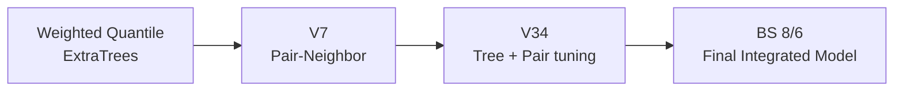

  

<h1 align="center">THIS IS STRESS</h1>

  <strong>스트레스 지수 예측 해커톤 · 2거 스트레스조</strong> 
  건강·생활 데이터를 이용해 0~1 범위의 스트레스 점수를 예측했습니다.

  <strong>Final: BS 8/6 · ExtraTrees 76% + Pair-Neighbor 24%</strong> 
  Public MAE <strong>0.1266866667</strong> · Private MAE <strong>0.1473</strong>

## Project

Train 3,000건의 신체·건강·생활 정보를 이용하는 정형 데이터 회귀 문제입니다. 평가지표는 MAE이며 낮을수록 좋습니다.

연구 과정에서는 BMI, 맥압, 평균동맥압, 콜레스테롤·혈당 비율과 결측 패턴을 파생변수로 검토했고, ExtraTrees와 Pair-Neighbor를 중심으로 전역 패턴과 국소 유사성을 함께 모델링했습니다.

## Final Result

| 항목 | 결과 |
|---|---:|
| 최종 채택 모델 | **BS 8/6 — ExtraTrees + Pair-Neighbor** |
| 내부 검증 MAE | **0.147300** |
| Public MAE | **0.1266866667** |
| Private MAE | **0.1473** |
| Blend | **ExtraTrees 76% + Pair-Neighbor 24%** |

  

최종 모델은 1,200개의 ExtraTree 예측을 54% 분위수로 집계하고, 8개 피처의 28개 Pair 공간에서 얻은 이웃 예측을 48% 분위수로 집계한 뒤 `76:24`로 결합합니다. 거리 `< 0.2`의 근접중복은 최근접 Train 타깃으로 보정하고 최종 값을 0.01 단위로 반올림합니다.

Public `0.1265`를 기록한 별도 후보도 있었지만 내부 검증과 Private 결과가 충분히 확인되지 않아 최종 발표에서는 BS 8/6 모델을 채택했습니다.

## Model Lineage

세부 점수와 원본 위치는 [`stress_project_UNIFIED`](https://github.com/thisisstress/stress_project_UNIFIED)에 정리되어 있습니다.

## Repositories

| Repository | 내용 |
|---|---|
| **[`stress_project_UNIFIED`](https://github.com/thisisstress/stress_project_UNIFIED)** | **팀 최종 결과, 모델 계보, 주요 점수** |
| [`stress_project_BS`](https://github.com/thisisstress/stress_project_BS) | 최종 BS 8/6 모델과 ExtraTrees·Pair-Neighbor 실험 |
| [`stress_project_JH`](https://github.com/thisisstress/stress_project_JH) | V7 Pair-Neighbor 연구와 재현 코드 |
| `stress_project_SK` | 대안 모델, UQC/Gower, 자동 연구와 강건성 검증을 보존하는 내부 R&D 저장소 |

처음 보는 경우 `stress_project_UNIFIED`에서 전체 결과를 확인한 뒤 BS 또는 JH 저장소의 실행·검증 기록을 보는 것이 가장 빠릅니다.

## Team

| [김지현](https://github.com/KimPooh) | [박빛샘](https://github.com/qlctoa) | [안상균](https://github.com/emotigom) |
|---|---|---|
| 일정 조율 · 파생변수 · 모델 개선 | 발표 자료 · ExtraTrees · 분위수 조정 | GitHub·Notion · 대안 모델 · 튜닝 |

역할은 발표자료의 주요 담당 영역을 기준으로 한 요약이며, 가설·실험·검증과 최종 모델 선정은 팀 협업으로 진행했습니다.

연구 결과는 실제 의료 판단이나 임상 의사결정을 위한 모델이 아닙니다.

## License and attribution

**Public view · no public reuse license.**  
조직 프로필의 팀 제작 코드·문서·원본 시각 자료는 All Rights Reserved. 별도 서면 허가 없는 재사용·수정·재배포 불가.

공동 저자와 역할: [AUTHORS.md](https://github.com/thisisstress/.github/blob/main/AUTHORS.md) · 권리 범위: [LICENSE](https://github.com/thisisstress/.github/blob/main/LICENSE) · [LICENSE_SCOPE.md](https://github.com/thisisstress/.github/blob/main/LICENSE_SCOPE.md)
