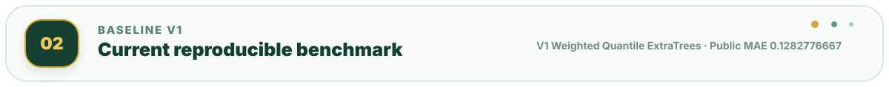
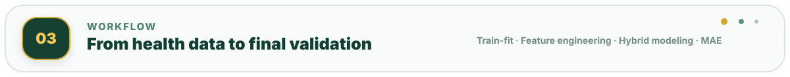
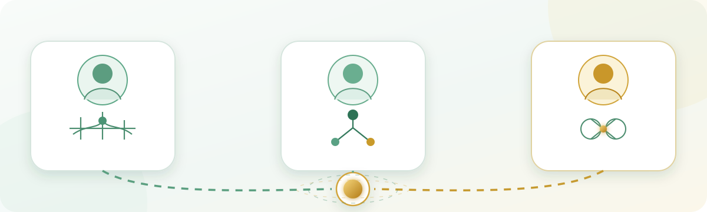
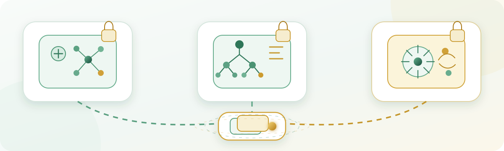
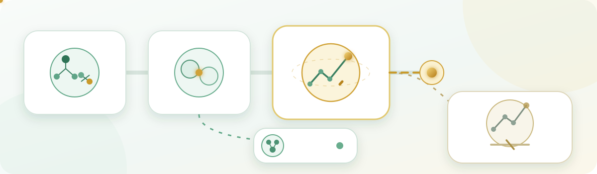
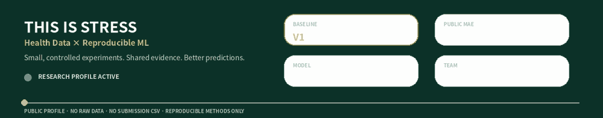

  

<h1 align="center">THIS IS STRESS</h1>

  <strong>스트레스 지수 예측 해커톤 · 2거 스트레스조</strong> 
  개인의 건강·생활 데이터를 바탕으로 0~1 범위의 스트레스 점수를 예측합니다.

  <strong>최종 채택 · 8월 6일 통합모델</strong> 
  <code>ExtraTrees 76%</code> + <code>Pair-Neighbor 24%</code> 
  <strong>Public MAE 0.1266866667</strong> · Private MAE 0.1473

  
  
   
  
  
   
  
  

<!-- CURRENT-RESULT:START -->

> **Final presentation aligned · updated 2026-08-08**  
> 최종 발표에서는 **재현 가능하고 Private까지 확인된 8월 6일 통합모델**을 최종 채택했습니다.  
> `ExtraTrees 1,200` · `Tree Q=54%` · `Pair Q=48%` · `Blend 76:24` · **Public MAE 0.1266866667 · Private MAE 0.1473**  
> Public `0.1265`의 Fresh V6는 내부·Private 검증 기록이 없어 최종 채택에서 제외했습니다.

<!-- CURRENT-RESULT:END -->

  

| Health signals | Hybrid modeling | Shared evidence |
|---|---|---|
| BMI, 맥압, 평균동맥압, 콜레스테롤·혈당 비율과 결측 패턴처럼 원본 건강 데이터를 더 의미 있게 표현합니다. | ExtraTrees가 전역 비선형 패턴을, Pair-Neighbor가 국소 유사 프로필을 보완하는 구조를 검증합니다. | Fold-local 전처리와 재현 가능한 실험 기록을 바탕으로 개인 실험을 팀의 공통 근거로 축적합니다. |

  이미지는 연구 흐름만 표현하고, 모델명·수치·설명은 README 텍스트로 분리해 이후 결과 변경에도 재사용할 수 있도록 구성했습니다.

  

  <strong>Final adopted model · BS 8/6</strong> 
  <code>ExtraTrees × 1,200</code> · <code>Tree Q=0.54</code> 
  <code>Pair-Neighbor 8 features / 28 pairs</code> · <code>Pair Q=0.48</code> 
  <code>Blend 76:24</code> · <code>Near-duplicate override &lt; 0.2</code> 
  <strong>Public MAE 0.1266866667</strong> · Private MAE 0.1473

  최종 발표에서는 Public 최저값만이 아니라 내부 검증과 Private 결과까지 확인된 모델을 최종 채택했습니다.

  

| 01 Data | 02 Preprocess | 03 Features | 04 Hybrid Model | 05 Validate |
|---|---|---|---|---|
| 신체·건강·생활 데이터 | Train 기준 결측·인코딩 | BMI·혈압·대사·결측 파생 | ExtraTrees + Pair-Neighbor | CV·Public·Private 근거 종합 |

<strong>5-step workflow details</strong>

1. **Data** — Train 3,000건 × 18개 컬럼에서 `stress_score`를 학습하고, Test 3,000건 × 17개 컬럼의 점수를 예측합니다.
2. **Preprocess** — 수치형 결측은 Train 중앙값, 범주형 결측은 `missing` 범주로 처리하고 One-Hot Encoding 기준도 Train에서만 학습합니다.
3. **Features** — BMI, 맥압, 평균동맥압, 혈압 비율, 콜레스테롤·혈당 비율, 결측치 개수를 만들고 중요 피처 선택 기회를 높입니다. 최종 모델에서는 `gender` 제거와 Fold-local Winsorization도 적용합니다.
4. **Hybrid Model** — ExtraTrees 1,200개의 54% 분위수와 8개 피처·28개 Pair-Neighbor의 48% 분위수를 `76:24`로 결합하고, 거리 `< 0.2`의 근접중복은 최근접 Train 타깃으로 보정합니다.
5. **Validate & Select** — 내부 CV와 실제 Public·Private 결과를 함께 확인합니다. Public `0.1265`의 Fresh V6보다 검증 근거가 완전한 **8월 6일 통합모델**을 최종 채택했습니다.

  

| 01 Train-only | 02 No Leakage | 03 Reproducible | 04 Evidence-based |
|---|---|---|---|
| 전처리 기준은 Train에서 학습 | Test 전체 통계를 모델 선택에 사용하지 않음 | 고정 설정과 실행 기록을 남김 | 한 번의 점수보다 CV·Public·Private 근거를 함께 확인 |

  <strong>좋은 점수보다 먼저, 같은 조건에서 다시 확인할 수 있는 결과를 남깁니다.</strong> 
  최종 모델 역시 Public 최저값 하나가 아니라 재현 가능한 내부 검증과 Private 결과까지 확인한 뒤 선택했습니다.

<strong>Research & disclosure policy</strong>

- 수치형 결측값, 범주형 인코딩, Winsorization과 Rank 기준은 해당 Train 범위에서만 계산합니다.
- Test 전체 분포나 다른 Test 행의 정보를 이용해 모델이나 하이퍼파라미터를 선택하지 않습니다.
- 주요 모델 설정과 난수 시드를 고정하고 Notebook·GitHub 기록을 남겨 재현 가능성을 확보합니다.
- Public 점수만으로 후보를 승격하지 않고 내부 CV, 안정성, 실제 Public·Private 근거를 구분해 해석합니다.
- 원본 대회 데이터, 제출 CSV와 비공개 학습 산출물은 공개하지 않습니다.
- 공개 코드에는 비밀키와 개인 식별 정보를 포함하지 않습니다.

  

| 김지현 · 팀장 | 박빛샘 | 안상균 |
|---|---|---|
| 프로젝트 일정 조율 · 파생변수 · 모델 개선 | 발표 자료 제작 · ExtraTrees · 분위수 조정 | GitHub·Notion 관리 · 대안 모델 · 튜닝 |

  <strong>가설 공유 → 개별 실험 → 결과 비교 → 효과가 확인된 개선안 축적</strong> 
  Notion과 ZEP으로 소통하고, GitHub 저장소를 통해 코드·설정·실험 결과를 공유했습니다.

  

| Repository | 역할 | 현재 접근 |
|---|---|---|
| `stress_project_JH` | Team V7 · Pair-Neighbor와 팀 기준 계보 | Private |
| `stress_project_BS` | 최종 BS 8/6 · ExtraTrees/Pair 고도화 · 발표자료 | Private |
| `stress_project_SK` | 대안 모델 · 강건성 검증 · 연구 엔진 기록 | Private |
| `stress_project_UNIFIED` | 대표 모델 계보 · 점수 · 팀 공통 허브 | Private |

  <strong>개별 연구는 분리하고, 확인된 계보와 결과는 UNIFIED에서 연결합니다.</strong> 
  네 저장소는 현재 모두 Private이며, 접근 권한이 있는 팀원에게만 표시됩니다. 공개 전환 시점은 이 README에서 미리 약속하지 않습니다.

  

| 모델 | 내부 검증 | Public MAE | 상태 |
|---|---:|---:|---|
| Team V7 Pair-Neighbor | 0.146644 | 0.1272333333 | 계보 이정표 |
| BS V34 Tree·Pair Joint Tuning | 0.148033 | 0.1271866667 | 계보 이정표 |
| **BS 8/6 Final Integrated Model** | **0.147300** | **0.1266866667** | **최종 채택 · Private 0.1473** |
| P56C MI-weighted Gower | Robust CV 0.149096 | 0.130060 | 독립 모델 · 보존 |
| Fresh V6 | — | **0.1265** | 미채택 · 내부/Private 검증 기록 없음 |

  <strong>Final research snapshot · 2026-08-08</strong> 
  내부 MAE는 모델별 split·seed·검증 계약이 다를 수 있어 작은 차이를 직접 순위화하지 않습니다. 최종 채택은 재현 가능한 내부 검증과 Public·Private 근거를 함께 고려했습니다.

  

  Click the footer to return to the organization overview.

