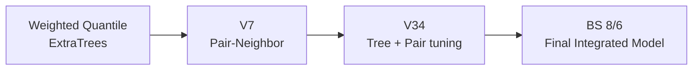

  

<h1 align="center">THIS IS STRESS</h1>

  <strong>스트레스 지수 예측 해커톤 · 2거 스트레스조</strong> 
  Tabular regression · MAE · ExtraTrees · Pair-Neighbor

  <strong>Final: BS 8/6 · ExtraTrees 76% + Pair-Neighbor 24%</strong> 
  Public MAE <strong>0.1266866667</strong> · Private MAE <strong>0.1473</strong>

## Project

**Task:** Train 3,000건 기반 `stress_score` 회귀  
**Target range:** `0~1`  
**Metric:** MAE  
**Feature axes:** BMI · 맥압 · 평균동맥압 · 콜레스테롤/혈당 비율 · 결측 패턴

## Final Result

| 항목 | 결과 |
|---|---:|
| 최종 채택 모델 | **BS 8/6 — ExtraTrees + Pair-Neighbor** |
| 내부 검증 MAE | **0.147300** |
| Public MAE | **0.1266866667** |
| Private MAE | **0.1473** |
| Blend | **ExtraTrees 76% + Pair-Neighbor 24%** |

  

**Tree:** 1,200 ExtraTrees · Q54  
**Pair:** 8 features · 28 pair spaces · Q48  
**Blend:** `76:24`  
**Near-duplicate:** distance `< 0.2` → nearest Train target  
**Output:** 0.01 rounding

**Fresh V6:** Public `0.1265` · 내부/Private 검증 계약 부족 · 미채택

## Model Lineage

**SSOT:** [`stress_project_UNIFIED`](https://github.com/thisisstress/stress_project_UNIFIED)

## Repositories

| Repository | 범위 |
|---|---|
| **[`stress_project_UNIFIED`](https://github.com/thisisstress/stress_project_UNIFIED)** | **팀 최종 결과 · 모델 계보 · 주요 점수** |
| [`stress_project_BS`](https://github.com/thisisstress/stress_project_BS) | 최종 BS 8/6 · ExtraTrees/Pair-Neighbor |
| [`stress_project_JH`](https://github.com/thisisstress/stress_project_JH) | V7 Pair-Neighbor · 재현 코드 |
| `stress_project_SK` | 대안 모델 · UQC/Gower · 내부 R&D |

**Reading order:** UNIFIED → BS / JH → SK

## Team

| [김지현](https://github.com/KimPooh) | [박빛샘](https://github.com/qlctoa) | [안상균](https://github.com/emotigom) |
|---|---|---|
| 일정 조율 · 파생변수 · 모델 개선 | 발표 자료 · ExtraTrees · 분위수 조정 | GitHub·Notion · 대안 모델 · 튜닝 |

**Role labels:** 발표자료 기준 주요 담당 영역 · 가설/실험/검증/최종 선정은 팀 협업

**용도 제한:** 임상 의사결정용 모델 아님.

## License and attribution

**Public view · no public reuse license.**  
조직 프로필의 팀 제작 코드·문서·원본 시각 자료는 All Rights Reserved. 별도 서면 허가 없는 재사용·수정·재배포 불가.

공동 저자와 역할: [AUTHORS.md](https://github.com/thisisstress/.github/blob/main/AUTHORS.md) · 권리 범위: [LICENSE](https://github.com/thisisstress/.github/blob/main/LICENSE) · [LICENSE_SCOPE.md](https://github.com/thisisstress/.github/blob/main/LICENSE_SCOPE.md)
