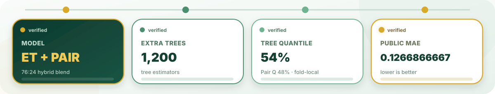

  

  <strong>건강 데이터를 더 정확하고, 더 재현 가능하게.</strong> 
  스트레스 지수 예측을 위한 팀 연구 허브입니다.

  
  
   
  
  
   
  
  

<!-- CURRENT-RESULT:START -->

> **Research in progress · current result updated 2026-08-07**  
> 이 화면은 **2026-08-06 통합 모델의 현재 확인 결과**를 표시합니다.  
> `ExtraTrees 1,200` · `Tree Q=54%` · `Pair Q=48%` · `Blend 76:24` · **Public MAE 0.1266866667**  
> 최종 공개 리포와 발표 자료가 확정되면 이 블록과 `profile/content.json`을 한 번 더 갱신합니다.

<!-- CURRENT-RESULT:END -->

  

  <strong>Health signals</strong> · <strong>Reproducible ML</strong> · <strong>Shared evidence</strong>

  

  <strong>Current verified public result · final publication pending</strong> 
  <code>ExtraTrees × 1,200</code> · <code>Pair-Neighbor 8 features / 28 pairs</code> 
  <code>Tree Q=0.54</code> · <code>Pair Q=0.48</code> · <code>Blend 76:24</code> 
  <strong>Public MAE 0.1266866667</strong>

  

<strong>5-step workflow details</strong>

1. **Data** — Train에서만 결측치 처리와 인코딩 기준을 학습합니다.
2. **Features** — BMI, 맥압, 평균동맥압, 대사 비율과 결측 패턴을 구성합니다.
3. **Models** — ExtraTrees는 전역 비선형 패턴을, Pair-Neighbor는 국소 유사 프로필을 학습합니다.
4. **Aggregation** — Tree 54% 분위수와 Pair 48% 분위수를 `76:24`로 결합합니다.
5. **Validation** — Fold-local 처리와 반복 검증으로 개선의 재현성을 확인합니다.

<strong>Public profile policy</strong>

이 프로필에는 **재현 가능한 연구 방법, 모델 구조, 검증 원칙과 공개 가능한 결과**만 게시합니다.

- 원본 대회 데이터는 공개하지 않습니다.
- 제출 CSV와 학습 산출물은 공개하지 않습니다.
- 공개가 허용된 성능 기록만 게시합니다.
- 공개 코드에는 비밀키와 개인 식별 정보를 포함하지 않습니다.

  

  <strong>김지현 · 박빛샘 · 안상균</strong> 
  3 researchers · shared evidence · final publication pending

  

  Research repositories remain private until the competition and disclosure policy allow a public release.

  

  
    Current result snapshot: 2026-08-07 ·
    update <code>profile/content.json</code> and regenerate assets when the final publication is fixed.
  

  

  Click the footer to return to the organization overview.

