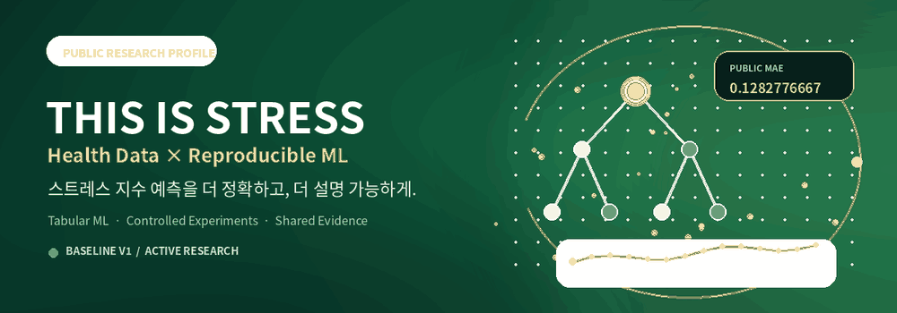
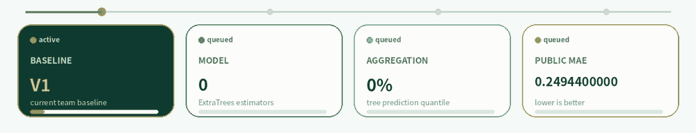
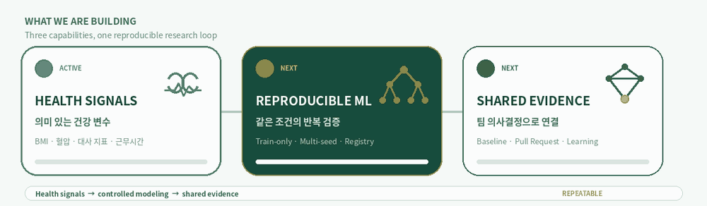
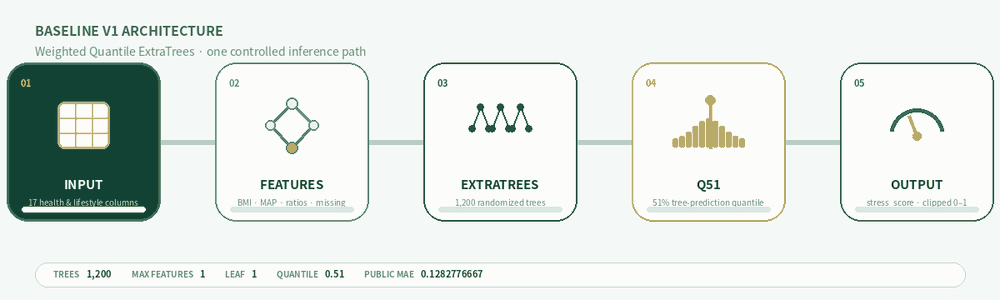
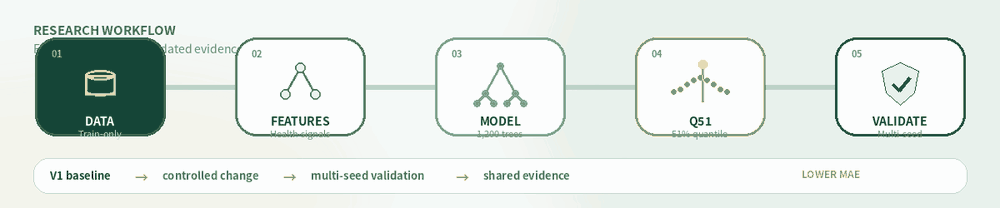
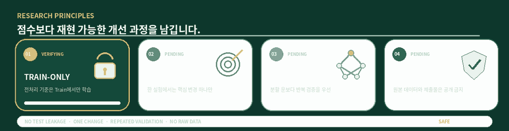
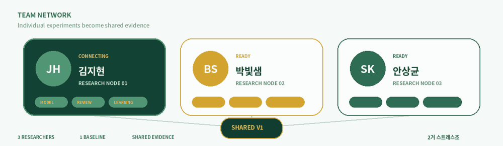
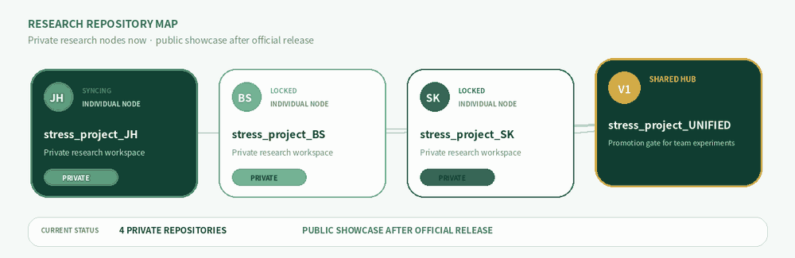
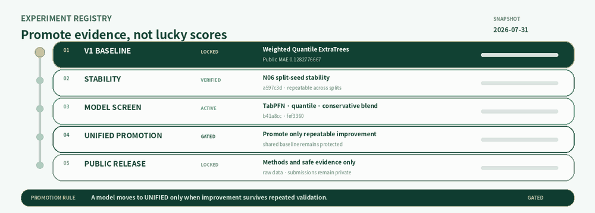

  

  <strong>건강 데이터를 더 정확하고, 더 재현 가능하게.</strong> 
  스트레스 지수 예측을 위한 팀 연구 허브입니다.

  
  
   
  
  
   
  
  

  

  <strong>Health signals</strong> · <strong>Reproducible ML</strong> · <strong>Shared evidence</strong>

  

  <code>ExtraTrees × 1,200</code> · <code>max_features=1</code> 
  <code>Q=0.51</code> · <strong>Public MAE 0.1282776667</strong>

  

<strong>5-step workflow details</strong>

1. **Data** — Train에서만 결측치 처리와 인코딩 기준을 학습합니다.
2. **Features** — BMI, 맥압, 평균동맥압, 대사 비율과 결측 패턴을 구성합니다.
3. **Model** — ExtraTrees의 강한 무작위성으로 비선형 관계를 학습합니다.
4. **Aggregation** — 평균 대신 51% 분위수로 MAE에 맞춘 예측을 만듭니다.
5. **Validation** — 여러 Seed와 그룹 분할에서 개선이 유지되는지 확인합니다.

<strong>Public profile policy</strong>

이 프로필에는 **재현 가능한 연구 방법, 모델 구조, 검증 원칙과 공개 가능한 결과**만 게시합니다.

- 원본 대회 데이터는 공개하지 않습니다.
- 제출 CSV와 학습 산출물은 공개하지 않습니다.
- Private Score는 공식 공개 이후에만 기록합니다.
- 공개 코드에는 비밀키와 개인 식별 정보를 포함하지 않습니다.

  

  <strong>김지현 · 박빛샘 · 안상균</strong> 
  3 researchers · 1 baseline · shared evidence

  

  Repositories remain private until the competition and disclosure policy allow a public release.

  

  Snapshot dated 2026-07-31 · update <code>profile/content.json</code> when research status changes.

  

  Click the footer to return to the organization overview.

