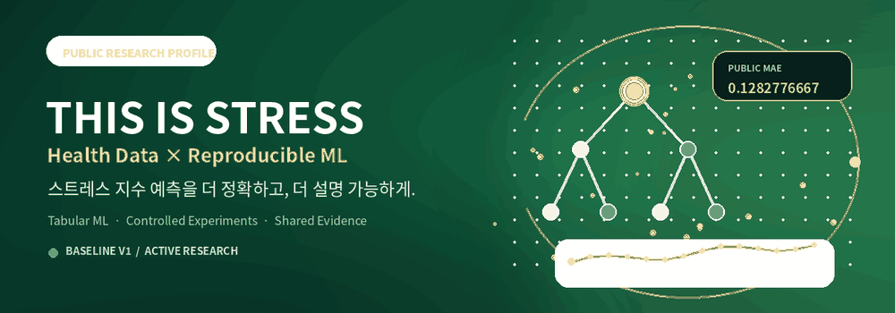
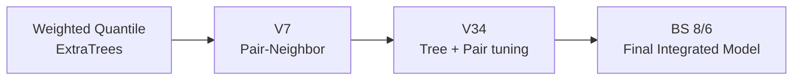

  

<h1 align="center">THIS IS STRESS</h1>

  <strong>스트레스 지수 예측 해커톤 · 2거 스트레스조</strong> 
  Tabular regression · MAE · ExtraTrees · Pair-Neighbor

  

## Project & Final Result

**Task:** Train 3,000건 기반 `stress_score` 회귀 · **Target:** `0~1` · **Metric:** MAE  
**Feature axes:** BMI · 맥압 · 평균동맥압 · 콜레스테롤/혈당 비율 · 결측 패턴

| 항목 | 결과 |
|---|---:|
| 최종 채택 모델 | **BS 8/6 — ExtraTrees + Pair-Neighbor** |
| 내부 검증 MAE | **0.147300** |
| Public MAE | **0.1266866667** |
| Private MAE | **0.1473** |
| Blend | **ExtraTrees 76% + Pair-Neighbor 24%** |

  

**Tree:** 1,200 ExtraTrees · Q54  
**Pair:** 8 features · 28 pair spaces · Q48  
**Blend:** `76:24`  
**Near-duplicate:** distance `< 0.2` → nearest Train target  
**Output:** 0.01 rounding

<strong>Score interpretation & comparison rules</strong>

- **MAE는 낮을수록 우수**합니다.
- 초기 공통 기준점 V1 `0.1282776667` → 최종 `0.1266866667`: ΔMAE `-0.0015910` (약 **1.24% 상대 감소**)
- 후반 팀 계보 이정표 V7 `0.1272333333` → 최종 `0.1266866667`: ΔMAE `-0.0005467` (약 **0.43% 상대 감소**)
- V14 `0.1278085845` → 최종은 약 **0.88% 상대 감소**이지만, V14는 historical public reference이며 canonical baseline으로 사용하지 않습니다.
- 서로 다른 내부 검증 계약의 미세 MAE는 직접 순위화하지 않습니다.
- Public-only 탐색 후보와 최종 채택 모델은 구분해 기록하며, 최종 결과는 재현 가능한 검증 계약과 함께 해석합니다.

→ [점수 해석·비교 규칙과 미채택 후보 설명](https://github.com/thisisstress/stress_project_UNIFIED/blob/main/docs/EVALUATION_NOTES.md)

## Model Journey

  

<strong>Exact model lineage</strong>

```mermaid
flowchart LR
    V1[Weighted Quantile<br/>ExtraTrees] --> V7[V7<br/>Pair-Neighbor]
    V7 --> V34[V34<br/>Tree + Pair tuning]
    V34 --> FINAL[BS 8/6<br/>Final Integrated Model]
```

**SSOT:** [`stress_project_UNIFIED`](https://github.com/thisisstress/stress_project_UNIFIED)

## Validation & Evidence

  

## Repositories

| Repository | 범위 |
|---|---|
| **[`stress_project_UNIFIED`](https://github.com/thisisstress/stress_project_UNIFIED)** | **팀 최종 결과 · 모델 계보 · 주요 점수** |
| [`stress_project_BS`](https://github.com/thisisstress/stress_project_BS) | 최종 BS 8/6 · ExtraTrees/Pair-Neighbor |
| [`stress_project_JH`](https://github.com/thisisstress/stress_project_JH) | V7 Pair-Neighbor · 재현 코드 |
| `stress_project_SK` *(private)* | 대안 모델 · UQC/Gower · 후속 내부 R&D · 공개 최종 근거에는 사용하지 않음 |

**Public reading order:** UNIFIED → BS / JH  
**Internal follow-up:** SK는 private 후속 R&D 저장소로 공개 검증 경로에 포함하지 않음

## Team

- **[김지현](https://github.com/KimPooh)** — 실험 일정 조율 · 파생변수 설계 · 모델 개선
- **[박빛샘](https://github.com/qlctoa)** — 결과 시각화·발표 구성 · ExtraTrees · 분위수 조정
- **[안상균](https://github.com/emotigom)** — 실험 기록·재현성 관리 · 대안 모델 연구 · 튜닝

**Role labels:** 발표 자료와 저장소 기록 기준 주요 담당 영역 · 가설 수립/실험/검증/최종 선정은 팀 협업

**용도 제한:** 임상 의사결정용 모델 아님.

## License and attribution

**Public view · no public reuse license.**  
조직 프로필의 팀 제작 코드·문서·원본 시각 자료는 All Rights Reserved. 별도 서면 허가 없는 재사용·수정·재배포 불가.

공동 저자와 역할: [AUTHORS.md](https://github.com/thisisstress/.github/blob/main/AUTHORS.md) · 권리 범위: [LICENSE](https://github.com/thisisstress/.github/blob/main/LICENSE) · [LICENSE_SCOPE.md](https://github.com/thisisstress/.github/blob/main/LICENSE_SCOPE.md)

  

